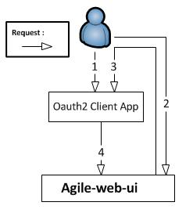

# AGILE Identity Management (a.k.a AGILE-IDM Web)

This component offers an oauth2 server which in turn can rely on third party Identity Providers (IdPs) to authenticate users in AGILE.
Currently, AGILE IDM supports the authorization code flow of Oauth2.
As a result, every application acting as a relying party (using AGILE IDM as identity provider), must be first registered with AGILE IDM. For more information please see the user authentication chapter (https://github.com/Agile-IoT/agile-idm-web-ui/blob/master/docs/authentication.md)

## Authorization Code and Access Token Flow

Assuming that an oauth client has been registered in AGILE IDM, the flow to obtain an access token for any AGILE user is depicted in the following picture.
<table align="center">
	<tr>
		<td></td>
	</tr>
	<tr align="center">
		<td>
			AGILE IDM interaction with Oauth2 clients
		</td>
	</tr>
</table>
From step 1 to 4, the authentication between IDM and the Oauth2 client occurs; however, it must be noted that in case AGILE IDM relies on another identity provider, such as google, to authenticate the user, additional steps will take place between step 2 and 3. In each step the following actions take place:

1. the user opens the Oauth2 client application, but he/she is not authenticated yet. 

2. the Oauth2 client App redirects the user to AGILE IDM presenting its client id and a redirect URL that will be called by IDM on successful authentication of the user (if this URL matches the registration of the oauth client). Subsequently, the user authenticates with AGILE IDM using any of the authentication providers available.

3. On succesful user authentication, IDM redirects the user with an authorization code (valid only for this client) to the client callback endoint.

4. Once the Oauth2 client application has received the authorization code, it calls IDM providing the authorization token along with its client id and client secret, in order to exchange the authorization code for a valid access token for this user. Once IDM returns a token (if id and secret are valid), it will delete the authorization code afterwards. From this point on, the application can use this token to interact with IDM, or with any other AGILE component that has been integrated with AGILE IDM.
