[](https://travis-ci.org/Agile-IoT/agile-IDM)

# AGILE Identity Management

## Architecture

AGILE Identity Management uses Identity Providers (IdPs) already available to authenticate users of the gateway.
These Identity Providers include:
* Linux-Pam authentication
* Github
* Google
* WebID

Further, IDM is split in two components. A web-server (at the moment it is required, but it will be optional in the future), and a loca component exposing an API through D-Bus.

### IDM Web Component

This component  (inside agile-idm-web-ui) implements an OAuth2 client to authenticate users towards external IdPs.
Currently Github is supported, but we have started to implement Google and Dropbox connectors.

During the OAuth2 redirections, this Web component sets a cookie on the browser and stores a mapping between the IdPs token and the cookie.
As a result, any requests containing the cookie are mapped to the user owning the authentication token generated by the IdP. This makes IDM user-friendly since users need to authenticate only once.


### IDM D-Bus Server

The D-Bus server  (inside agile-idm) provides functionality to store entities through basic CRUD interfaces. These entities are later used by the security framework to enforce security policies on them.


## Configuration

To configure the two IDM components, a JSON object is stored in a file within the conf folder. For every subsection, mention whether they are required for the IDM to execute properly or not.


### OAuth2 Configuration  (Mandatory for the use of external IdPs)

Since AGILE-IDM (Web component) behaves as an OAuth2 client, it needs to be configured with the proper credentials to act as a relying party in the protocol.

For each IdP (that will be used by the AGILE gateway owner), a clientID, and a clientSecret are required. To configure them properly, open the agile-idm-web-ui/conf/agile-ui.conf.
Then, the following attributes of the configuration need to be updated:

* clientID: OAuth2 client
* clientSecret: OAuth2 secret
* host_name: host and port where the AGILE gateway is running.

Assuming that you have retrieved a **client Id** 5y4rye1946, and a **clientSecret** vz20g6010oxttt0gyqv2, and that the gateway is running in localhost:3000 the github configuration should look like this:

```
"auth":{
       "github":{
            "clientID": "5y4rye1946",
            "clientSecret": "vz20g6010oxttt0gyqv2",
            "host_name": "http://localhost:3000",
            "redirect_path": "/callback_github",
            "initial_path": "/github",
            "final_path":"/static/index.html",
            "site": "https://github.com/login",
            "tokenPath": "/oauth/access_token",
            "scope": "notifications"
       },
       "google":{
          ...
       }
}
```
####Github step by step####

To get the client credentials from github, go to github homepage, log in and click on your profile image. In the drop down menu select **Settings** (see image 1).

<table align="center">
	<tr>
		<td>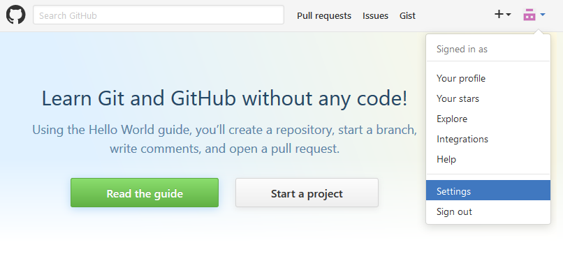</td>
		<td>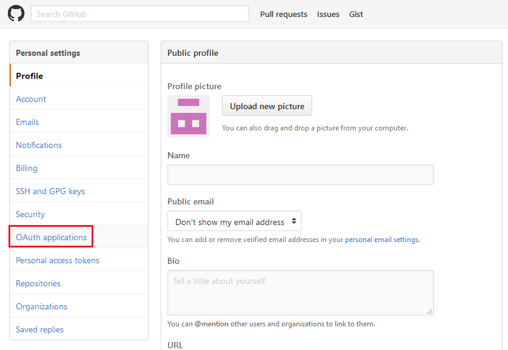</td>
	</tr>
	<tr align="center">
		<td>
			Image 1
		</td>
		<td>
			Image 2
		</td>
	</tr>
</table>

Then click on OAuth2 applications in the menu on the left hand side (see image 2).  
By default, this option opens the **Authorized applications** site (see image 3). Therefore you have to switch to the second tab **Developer Applications** (see image 4).

<table align="center">
	<tr>
		<td>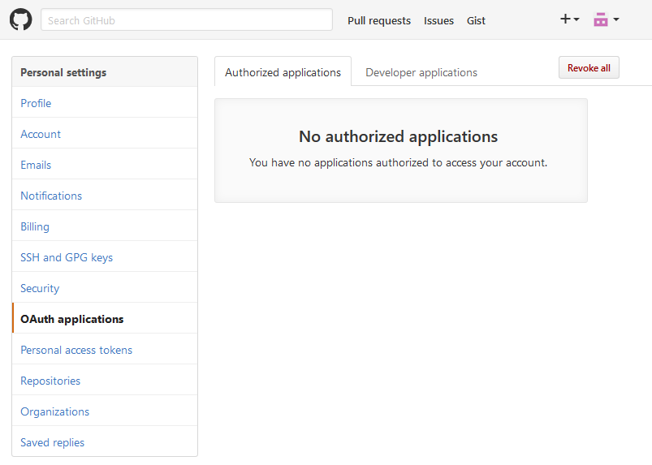</td>
		<td>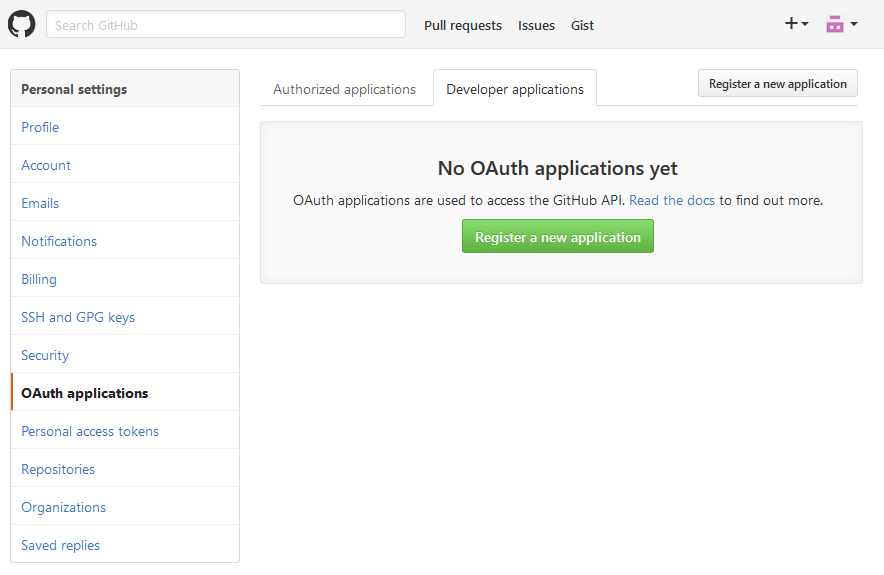</td>
	</tr>
	<tr align="center">
		<td>
			Image 3
		</td>
		<td>
			Image 4
		</td>
	</tr>
</table>

There you can register a new application. To do so, click on the **Register a new application** button.  
On the next site you have to fill three required fields (see image 5):  
With the first one "**Application name**" you can name your application.
The second flield named **Homepage URL** place the combination of $host_name+$initial_path (http://localhost:3000/github according to the example above).  
For the last field **Authorization callback URL**, you should place $host_name+$redirect_path (http://localhost:3000/callback_github in the example above).  
After filling the form click the **Register application** button.

<table align="center">
	<tr>
		<td>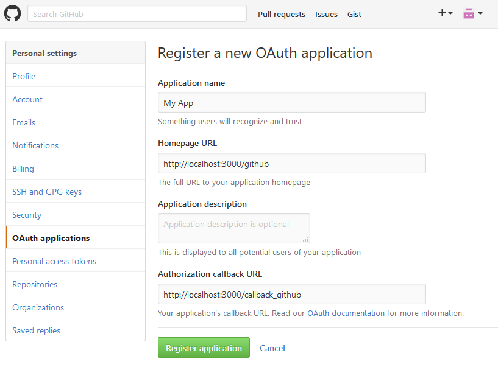</td>
		<td>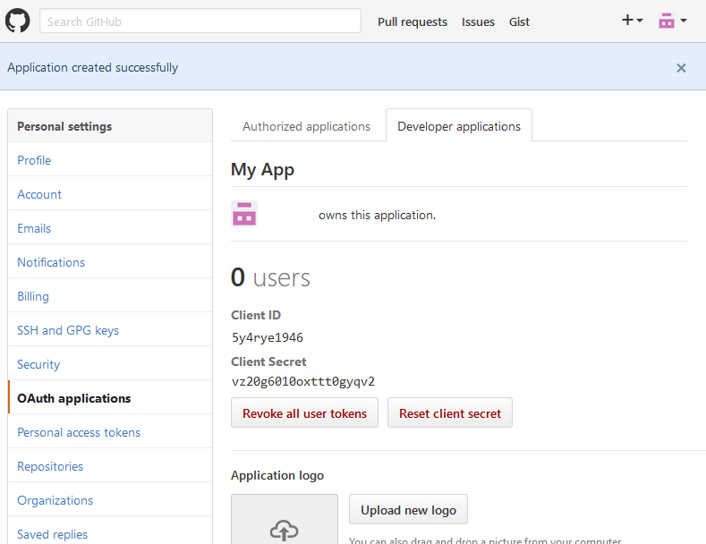</td>
	</tr>
	<tr align="center">
		<td>
			Image 5
		</td>
		<td>
			Image 6
		</td>
	</tr>
</table>

Now you can scroll to the top to find the **Client ID** and the **Client Secret** fields together with the corresponding values (see image 6).
Use those and place them in the proper configuration fields.

####Google Drive step by step####
To get the client credentials from Google Drive you have to go to the [Google Developer Console](https://console.developers.google.com/).
By default you are redirected to the **Library** menu. If not, simply click onto the **Library** tab on the left hand side.  
To use the Google OAuth2 authentication for IDM you have to enable **Drive API**. In order to do that, click onto the link **Drive API** below the heading **Google Apps APIs** (see image 1).

<table align="center">
	<tr>
		<td>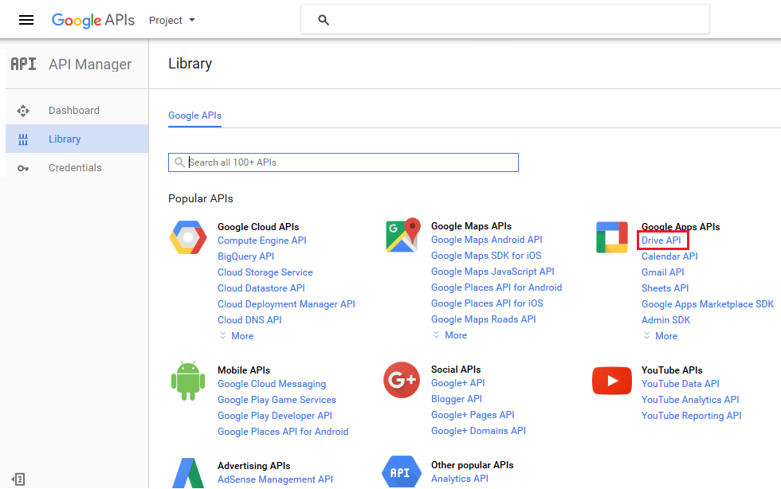</td>
		<td>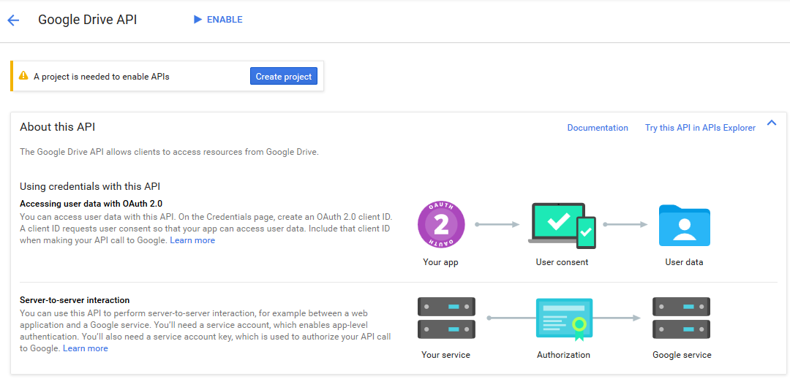</td>
	</tr>
	<tr align="center">
		<td>
			Image 1
		</td>
		<td>
			Image 2
		</td>
	</tr>
</table>
 
If not done yet, you will be asked to create a project in order to enable the API. Therefore click on the **create project** button (see image 2).  
In the following dialog click onto the **Create a project** button.
Enter the name of the project to be created and chose the options you like (see image 3).
<table align="center">
	<tr>
		<td>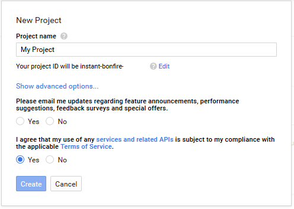</td>
		<td>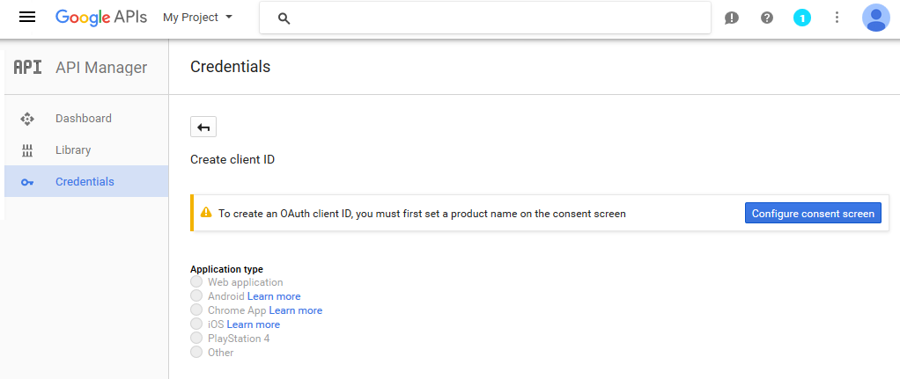</td>
	</tr>
	<tr align="center">
		<td>
			Image 3
		</td>
		<td>
			Image 4
		</td>
	</tr>
</table>
Make sure you agree the terms of service and a click on the **Create** button will create the project for you. This may take some seconds.
After the creation of the project you are redirected back to the page where you can enable the Drive API (image 2).
On the top right next to **Google Drive API** heading click the **Enable** button.

To be able to use the OAUth2 in IDM you need the client Id and the client secret. To obtain them click onto the **Credentials** tab on the left hand side.
As there are no credentials in the newly created project, yet you are asked to create them. Do so by clicking the button **Create credentials** and choosing **OAuth client ID**.  
First you are asked to create a consent screen which is shown whenever a user is asked to log in in order to authenticate to your app. Therefore click the **Configure consent screen** button (see image 4).  
Here you can put some information (see image 5). The only required fields are the **Email address** and the **Product name** ones. Fill out the formfields and click the **Save** button.
<table align="center">
	<tr>
		<td></td>
		<td>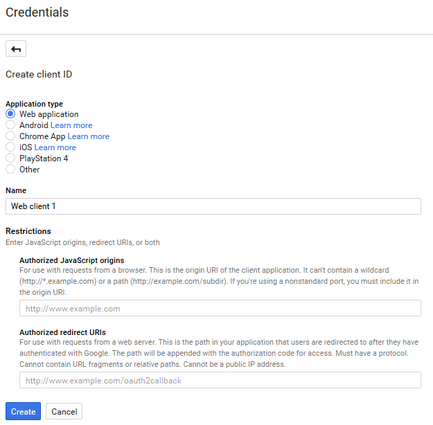</td>
	</tr>
	<tr align="center">
		<td>
			Image 5
		</td>
		<td>
			Image 6
		</td>
	</tr>
</table>

Now back on the Credentials site choose **Web application** and fill out the two fields (see image 6).  
In the first one named **Authorized JavaScript origins** you have to put the website that asks the user to authenticate.
As paths are not allowed here you have to use the base URI $host_name (http://localhost:3000 according to the example above).  
With the second field named **Authorized redirect URIs** you specify the url to wich the user will be redirected after authentication.
You should use $host_name+$redirect_path (http://localhost:3000/callback_google in the example above).  
Click the **Create** button and you will receive the needed client Id and client secret.  
Later you can always view the credentials again by clicking on the name of your product on the credentials site.
Use the client Id and client secret and update the following fields in the configuration file:

* clientID: OAuth2 client
* clientSecret: OAuth2 secret
* host_name: host and port where the AGILE gateway is running.

Assuming that you have retrieved a **client Id** 5y4rye1946, and a **clientSecret** vz20g6010oxttt0gyqv2, and that the gateway is running in localhost:3000 the google configuration should look like this:

```
"auth":{
       "github":{
            ...
       },
       "google":{
				"clientID": "5y4rye1946",
				"clientSecret": "vz20g6010oxttt0gyqv2",
				"host_name": "http://localhost:3000",
				"redirect_path": "/callback_google",
				"initial_path": "/google",
				"final_path":"/static/index.html",
				"site": "https://accounts.google.com",
				"authorizationPath": "/o/oauth2/auth",
				"tokenPath": "/o/oauth2/token",
				"scope": "https://www.googleapis.com/auth/drive https://www.googleapis.com/auth/userinfo.profile https://www.googleapis.com/auth/userinfo.email"
		}
}
```

### Web-ID TLS Certificate Configuration  (Optional)

web-ID relies on a TLS handshake, therefore IDM needs a certificate for the server side. We have included a self-signed certificate in the certs folder and it is configured by default. But, should you want to place your own certificate (please do!) please change the tls attribute of the configuration object in agile-idm-web-ui/conf/agile-ui.conf.

```
"tls":{
     "key":"../certs/server.key",
     "cert":"../certs/server.crt"
}
```

In this object you can place the path to your own server key and certificate.  However, if you don't update this, you would use the self-signed certificates by default. Which would work, as long as you instruct your browser to do this security exception...

## Run the Components

To run the web server, including oauth2, web id, pam, and REST HTTP api for authentication execute the following commands after checking out the project:

```
npm install
sudo apt-get install libpam0g-dev
cd agile-idm-web-ui
node ui-server.js
```

libpam0g-dev is a library required to perform PAM authentication, i.e. native linux authentication. This allows users to provide usernames and passwords to authenticate themselves with the underlying operating system So, if this functionality is not going to be used, you can execute  npm run-script no-auth-install instead of npm install and ignore the apt-get, or remove "authenticate-pam" from the package.json file and then ignore the apt-get command above.

and to run the core component (D-bus), you can execute the following commands (from the root of the folder checked out):

```
cd agile-idm/external-api/
npm install
cd external-api
node main.js
```

## Try it out


At the moment we have a simple demo that lets you authenticate using different identity providers (github, your linux operating system, a Web-ID certificate) and register an entity (sensor with a name). This registration is just valid for IDM. Soon, we shall do this registration from the AGILE device manager.

To test the demo follow this actions:

* Download and clone this repository
* Configure the components as needed. If you don't want to do any configuration, you can use the Web-ID authentication, or the PAM module out of the box. Otherwise, OAuth2 authentication requires to place the proper client id and secret in the configuration file as described previously.
* Run the components (as already described).
* go to your browser to http://localhost:3000/static/index.html
* authenticate with any mechanism you like
* click on the menu Sensors>Create
* write any name and any id, and then click on create

### Troubleshooting

As always... things could go wrong. So, here are a couple of common errors you may see:
* when you attempt to register a sensor:
    * you get "The name eu.agile.IDM was not provided by any .service files" error when you attempt to register a sensor: This happens when the core component (agile-idm/external-api/main.js) is not running.
    * you get "Error: 200 SyntaxError: JSON.parse: unexpected character at line 1 column 1 of the JSON data". This happens because the authentication step has not been performed (with any IdP provider...)


## Developer Documentation

To integrate AGILE IDM with an appliaction, please have a look at the ui-server.js.
