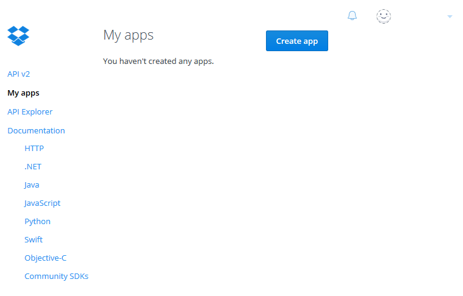
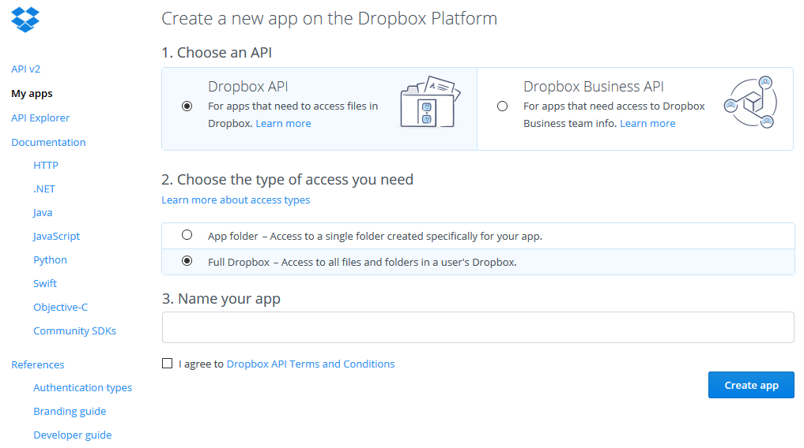
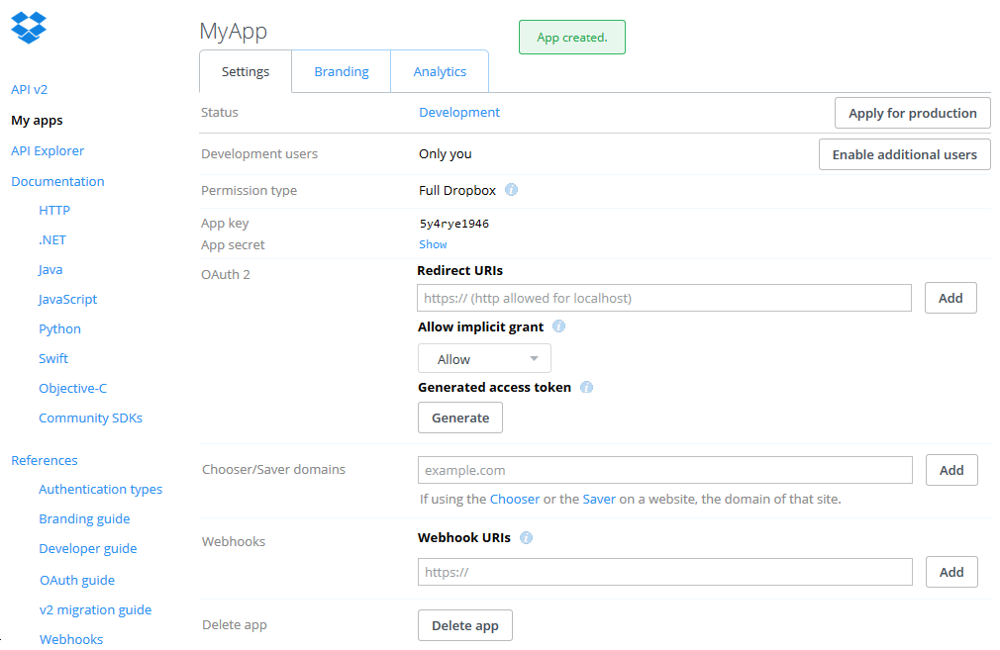

## Identity Providers Configuration

**although the configurations in this example and the repositories for agile use http for easy testing, you should always use https in production environments to interact with IDM since it sends and receives authorization codes an tokens**

This chapter covers the configuration of AGILE IDM, depending on which IdPs are used in a particular installation.

Many IdPs can be configured for AGILE-IDM; however, they are only attempted to be loaded when their name is in the list called "enabledStrategies" in the configuration file:
At the moment, the following strategy names are possible:

  * agile-local
  * github
  * google
  * webid
  * pam

Since AGILE-IDM should not let just any user with a valid account in github, google, etc log in in every gateway, the users which are allowed to log in in a particular gateway need to be registered previously, providing username and authentication type. For this the scripts in the folder scripts can be used.

 By default all Oauth2 providers (and all provider strategies) are available in "/auth/$strategy", i.e. pam authentication is available in /auth/pam, or google authentication is available in /auth/google.


### OAuth2 Providers  

Since AGILE-IDM (Web component) behaves as an OAuth2 client towards IdPs such as google and github, it needs to be configured with the proper credentials to act as a relying party in the protocol.

Every Oauth2 provider needs to redirect the user to the original relying party (in this case Identity Management). As a result, the IdP (Google, Github, etc) needs to know the url used for this callback. Similarly to the initial URL used to start the authentication of the user, the authorization code callbacks are always in /auth/callback_$oauth2provider. For example, google's callback is in /auth/callback_google, github's callback is in /auth/callback_github. Keep in mind that when the callback is configured in the **redirect_path** property, you also need to include the host and the port used.

For each IdP (that will be used by the AGILE gateway owner), a clientID, and a clientSecret are required. To configure them properly, open the conf/agile-ui-conf.js
Then, the following attributes of the configuration need to be updated:

* clientID: OAuth2 client
* clientSecret: OAuth2 secret

Assuming that you have retrieved a **client Id** 5y4rye1946, and a **clientSecret** vz20g6010oxttt0gyqv2, and that the gateway is running in localhost:3000 the github configuration should look like this:

```
"auth":{
	"github":{
		"clientID": "5y4rye1946",
		"clientSecret": "vz20g6010oxttt0gyqv2",
		"redirect_path": "http://localhost:3000/auth/callback_github",
		"scope": ["notifications"]
	},
 	"google":{
			...
	},
	"dropbox":{
			...
	}
}
```
####Github step by step####

To get the client credentials from github, go to github homepage, log in and click on your profile image. In the drop down menu select **Settings** (see image 1).

<table align="center">
	<tr>
		<td></td>
		<td></td>
	</tr>
	<tr align="center">
		<td>
			Image 1
		</td>
		<td>
			Image 2
		</td>
	</tr>
</table>

Then click on OAuth2 applications in the menu on the left hand side (see image 2).  
By default, this option opens the **Authorized applications** site (see image 3). Therefore you have to switch to the second tab **Developer Applications** (see image 4).

<table align="center">
	<tr>
		<td></td>
		<td></td>
	</tr>
	<tr align="center">
		<td>
			Image 3
		</td>
		<td>
			Image 4
		</td>
	</tr>
</table>

There you can register a new application. To do so, click on the **Register a new application** button.  
On the next site you have to fill three required fields (see image 5):  
With the first one "**Application name**" you can name your application.
The second field named **Homepage URL** place the following path (http://localhost:3000/auth/github according to the example above).  
For the last field "**Authorization callback URL**", you should place the value in $redirect_path (http://localhost:3000/auth/callback_github in the example above).  
After filling the form click the **Register application** button.

<table align="center">
	<tr>
		<td></td>
		<td></td>
	</tr>
	<tr align="center">
		<td>
			Image 5
		</td>
		<td>
			Image 6
		</td>
	</tr>
</table>

Now you can scroll to the top to find the **Client ID** and the **Client Secret** fields together with the corresponding values (see image 6).
Use those and place them in the proper configuration fields.

####Google Drive step by step####
To get the client credentials from Google Drive you have to go to the [Google Developer Console](https://console.developers.google.com/).
By default you are redirected to the **Library** menu. If not, simply click onto the **Library** tab on the left hand side.  
To use the Google OAuth2 authentication for IDM you have to enable **Drive API**. In order to do that, click onto the link **Drive API** below the heading **Google Apps APIs** (see image 1).

<table align="center">
	<tr>
		<td></td>
		<td></td>
	</tr>
	<tr align="center">
		<td>
			Image 1
		</td>
		<td>
			Image 2
		</td>
	</tr>
</table>

If not done yet, you will be asked to create a project in order to enable the API. Therefore click on the **create project** button (see image 2).  
In the following dialog click onto the **Create a project** button.
Enter the name of the project to be created and chose the options you like (see image 3).
<table align="center">
	<tr>
		<td></td>
		<td></td>
	</tr>
	<tr align="center">
		<td>
			Image 3
		</td>
		<td>
			Image 4
		</td>
	</tr>
</table>
Make sure you agree the terms of service and a click on the **Create** button will create the project for you. This may take some seconds.
After the creation of the project you are redirected back to the page where you can enable the Drive API (image 2).
On the top right next to **Google Drive API** heading click the **Enable** button.

To be able to use the OAUth2 in IDM you need the client Id and the client secret. To obtain them click onto the **Credentials** tab on the left hand side.
As there are no credentials in the newly created project, yet you are asked to create them. Do so by clicking the button **Create credentials** and choosing **OAuth client ID**.  
First you are asked to create a consent screen which is shown whenever a user is asked to log in in order to authenticate to your app. Therefore click the **Configure consent screen** button (see image 4).  
Here you can put some information (see image 5). The only required fields are the **Email address** and the **Product name** ones. Fill out the formfields and click the **Save** button.
<table align="center">
	<tr>
		<td></td>
		<td></td>
	</tr>
	<tr align="center">
		<td>
			Image 5
		</td>
		<td>
			Image 6
		</td>
	</tr>
</table>

Now back on the Credentials site choose **Web application** and fill out the two fields (see image 6).  
In the first one named **Authorized JavaScript origins** you have to put the website that asks the user to authenticate.
As paths are not allowed here you have to use the base URI $host_name (http://localhost:3000 according to the example below).  
With the second field named **Authorized redirect URIs** you specify the url to wich the user will be redirected after authentication.
You should use redirect_path (http://localhost:3000/auth/callback_google in the example below).  
Click the **Create** button and you will receive the needed client Id and client secret.  
Later you can always view the credentials again by clicking on the name of your product on the credentials site.
Use the client Id and client secret and update the following fields in the configuration file:

* clientID: OAuth2 client
* clientSecret: OAuth2 secret


Assuming that you have retrieved a **client Id** 5y4rye1946, and a **clientSecret** vz20g6010oxttt0gyqv2, and that the gateway is running in localhost:3000 the google configuration should look like this:

```
"auth":{
	"github":{
			...
	},
	"google":{
		"clientID": "5y4rye1946",
		"clientSecret": "vz20g6010oxttt0gyqv2",
		"redirect_path": "http://localhost:3000/auth/callback_google",
		"scope": [
       "https://www.googleapis.com/auth/drive",
       "https://www.googleapis.com/auth/userinfo.profile",
       "https://www.googleapis.com/auth/userinfo.email"
    ]
	},
	"dropbox":{
			...
	}		
}
```
<!-- ####Dropbox step by step####
To get the needed credentials from dropbox go to the [Dropbox App Console](https://www.dropbox.com/developers/apps) and log in.  
By default you will be directed to the **My apps** page (see image 1).  
There you can create the application for the IDM authentication by clicking the **Create App** Button.

<table align="center">
	<tr>
		<td></td>
		<td></td>
	</tr>
	<tr align="center">
		<td>
			Image 1
		</td>
		<td>
			Image 2
		</td>
	</tr>
</table>

On the next site you have to decide which kind of API you want to use (see image 2). For IDM the **Dropbox API** is enough.  
For the second option you can choose whatever you need.  
Third, you have to enter an unique name for your application.  
Last check the checkbox to confirm that you agree the terms and conditions of the Dropbox API and click the **Create App** button.  
Now your application will be created and you are redirected to its overview (see image 3).

<table align="center">
	<tr>
		<td></td>
	</tr>
	<tr align="center">
		<td>
			Image 3
		</td>
	</tr>
</table>

Fill in a redirect URL into the Field named **Redirect URIs** as a combination of $host_name+$redirect_path (http://localhost:3000/callback_dropbox according to the example below) and click the **Add** button.  
On this page you can also find the **App key** and after clicking on **Show** the **App secret**.

Use them and update the following fields in the configuration file:

* clientID: OAuth2 client
* clientSecret: OAuth2 secret
* host_name: host and port where the AGILE gateway is running.

Assuming that you have retrieved a **client Id** 5y4rye1946, and a **clientSecret** vz20g6010oxttt0gyqv2, and that the gateway is running in localhost:3000 the dropbox configuration should look like this:

```
"auth":	{
 	"github":{
			...
 	},
	"google":{
			...
	},
	"dropbox":{
		"clientID": "5y4rye1946",
		"clientSecret": "vz20g6010oxttt0gyqv2",
		"host_name": "http://localhost:3000",
		"redirect_path": "/callback_dropbox",
		"initial_path": "/dropbox",
		"final_path":"/static/index.html",
		"site": "https://www.dropbox.com/",
		"authorizationPath": "/1/oauth2/authorize",
		"tokenPath": "/1/oauth2/token",
		"scope": ""
	}
}
```
-->
### TLS Certificate and WebID

web-ID relies on a TLS handshake, therefore IDM needs a certificate for the server side. We have included a self-signed certificate in the certs folder and it is configured by default. But, should place your own certificate (please do!) please change the tls attribute of the configuration object in agile-idm-web-ui/conf/agile-ui.conf.

```
"tls":{
     "key":"../certs/server.key",
     "cert":"../certs/server.crt"
}
```
In this object you can place the path to your own server key and certificate.  However, if you don't update this, you would use the self-signed certificates by default. Which would work, as long as you instruct your browser to do this security exception...


### Agile-local authentication

IDM also offers a local authentication component. This component prompts the user for a unsername and password. The agile-local authentication relies on the entity storage, where all the entities are placed, to find entities of type user. They need to include a password.

### PAM authentication

IDM can also use the unerlying Linux PAM modules to authenticate with users that are registered in the linux machine where IDM is running. Since this requires 1) a linux machine and 2) additional libraries in the OS level, this needs to be configured properly.

to configure with PAM, the libpam0g-dev is a library required to perform PAM authentication, i.e. native linux authentication. This allows users to provide usernames and passwords to authenticate themselves with the underlying operating system.

To use PAM you need to install libpam0g-dev in your linux OS. For instance, in debian or ubuntu you can do:

```
sudo apt-get install libpam0g-dev
```

Afterwards you need to  install the pam node js authentication module by typing (if you need to revert the changes to recover the original package json just do git checkout.

```
npm install --save authenticate-pam
```
